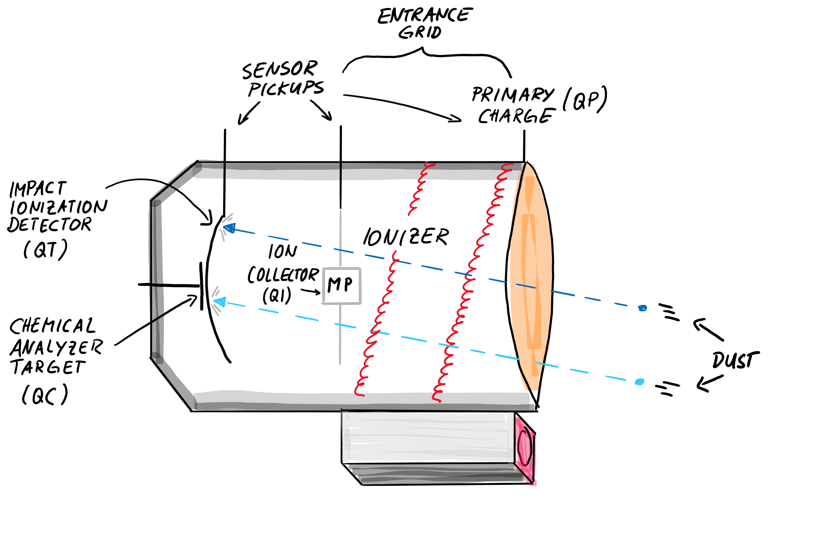
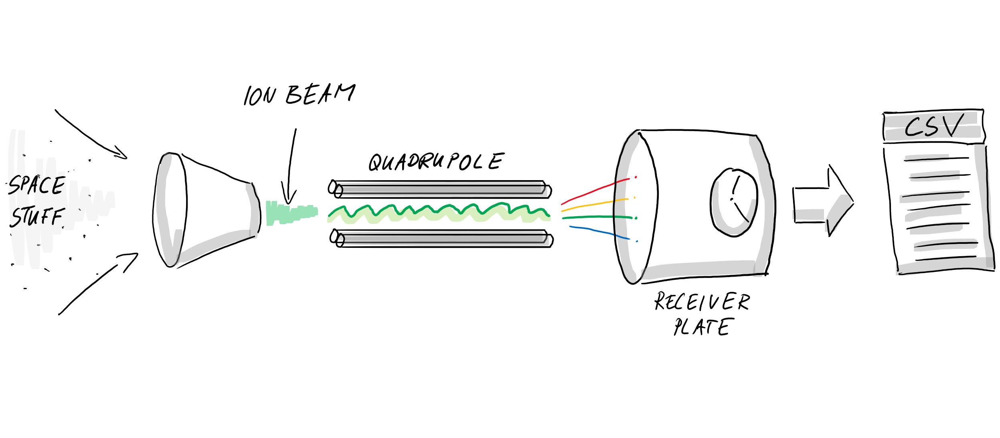

# My notes about: A Curious Moon by Rob Conery

This repository contains the implementation I did while reading the book -- every SQL query as well as a description **how to setup everything on Windows 10 using Docker**.

A Curious Moon by Rob Conery.

- Website: [https://bigmachine.io/products/a-curious-moon/](https://bigmachine.io/products/a-curious-moon/)
- Github: [https://github.com/red-4/curious-moon](https://github.com/red-4/curious-moon)

## Docker preparation

I have used Docker for Windows: [https://docs.docker.com/docker-for-windows/install/](https://docs.docker.com/docker-for-windows/install/).

### Using Docker Compose ...

To work with the Docker image I have created a *docker-compose.yaml* file. 
Visiting this file you will notice that the container port `5432` is mounted to the default Postgres port `5432`.
You will also notice the credentials how to access the database - e.g. with [pgAdmin](https://www.pgadmin.org/).
The configuration file mounts a directory `c:\Workspace\curious-moon-exercise` into the container.
This way you can edit files using the familiar editing tools - e.g. Visual Studio Code and Git.
Feel free to adjust the configuration to your needs.

Run `docker-compose up -d` to start the container in the background. 

### ... or run Docker manually

Pull the [Postgres Docker image](https://hub.docker.com/_/postgres).

I decided to use a shared folder (between the Windows Host and the Docker Container) to store the implementation files.

`docker run --volume //c/Workspace/curious-moon-exercise:/home/curious -d -p 5432:5432 --name curious-moon-exercise -e POSTGRES_PASSWORD=mysecretpassword postgres`

The advantage is that I can use VSCode and the Git tools I am familiar with - without additional installation steps - because they are already on my machine.

If you want to run the Docker container without the mounted folder you can use the following command:

`docker run -d -p 5432:5432 --name curious-moon-exercise -e POSTGRES_PASSWORD=mysecretpassword postgres`

## Starting a Bash on the Docker container

Once the Postgres database is running you can start with the exercise.

`docker exec -it curious-moon-exercise_database_1 bash` opens a Bash on the container. Make sure you use the correct container name here.

## Install make on the container

We will need make to do the exercise. (Note to myself: think about creating a Docker image which combines the Postgres image with a Make installation.)

`apt-get update -y` to update the APT catalogs.

`apt-get install -y make` to install _make_.

## Get the Cassini RAW data

Download the raw data from [http://archive.redfour.io/cassini/cassini_data.zip](http://archive.redfour.io/cassini/cassini_data.zip). To begin with I am only interested in the `master_plan.csv` file. The other files `cda.csv`, `inms.csv`, `jpl_flybys.csv`, and `chem_data.csv` will also be necessary later.

## Use PGAdmin to connect to the database

Make a new server connection `localhost` with port `5432` and username `postgres` and password `mysecretpassword`.

Name the connection `Curious-Moon-Enceladus`.

## Create a Database using PSQL

Open a Bash on the docker container.

`psql -U postgres` to open the Postgres shell (PSQL) for the user `postgres`.

`create database enceladus;` to create a database if it is not there yet (e.g. if it was dropped before)

Type `\q` to exit Postgres shell (PSQL).

## Images

I really liked Dee's drawings to make things clearer - that's why I drew them myself.

### Cosmic dust analyzer (CDA)

### Ion and Neutral Mass Spectrometer (INMS)

